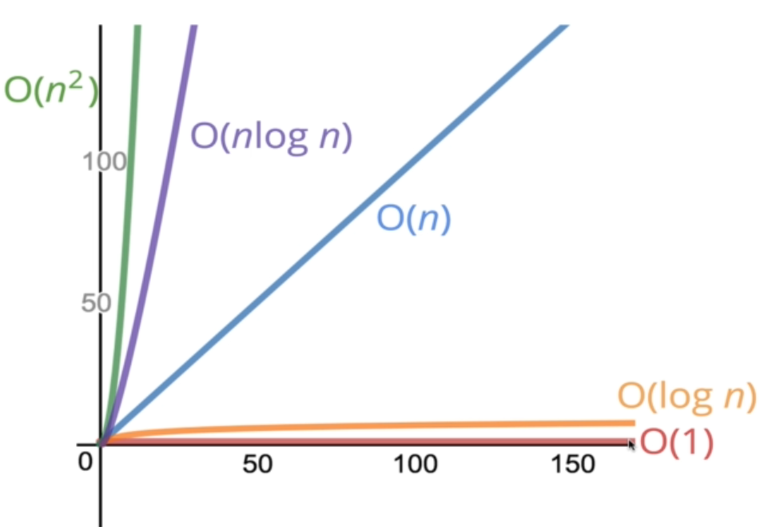
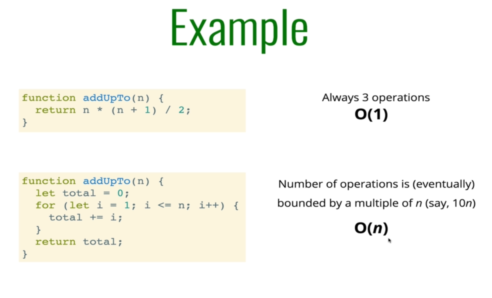
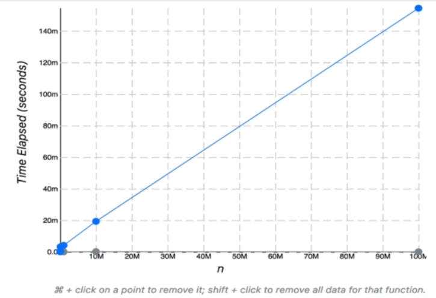
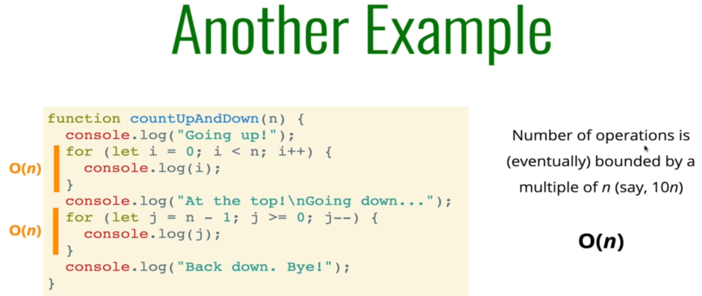
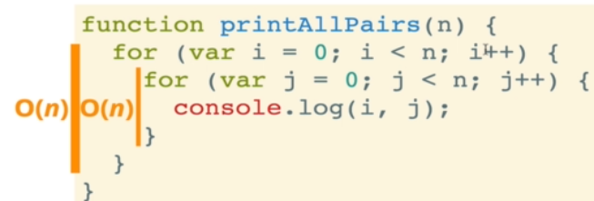
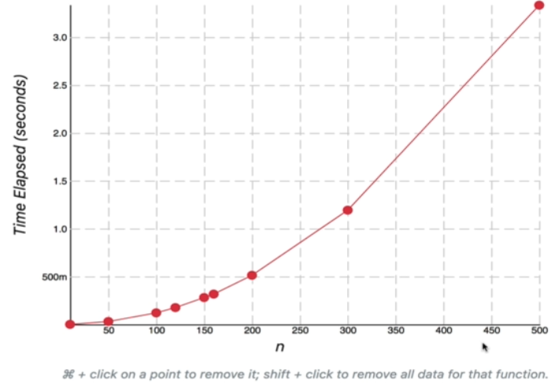
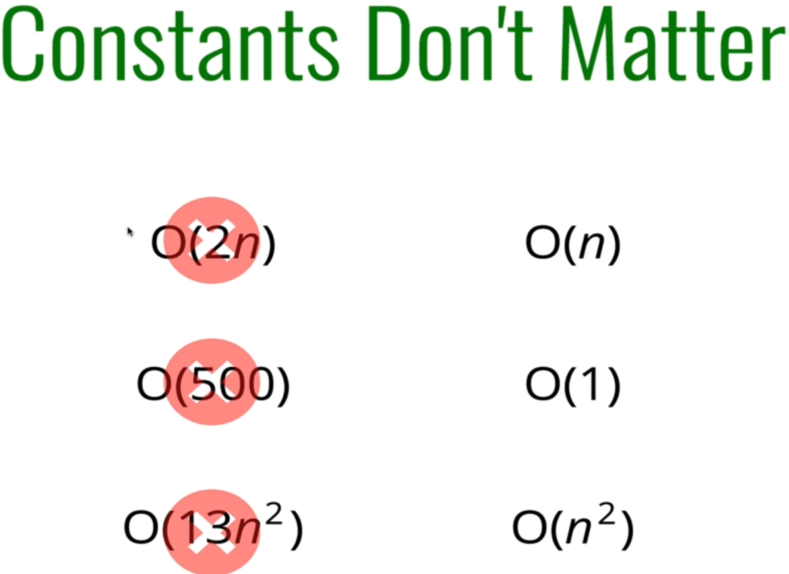
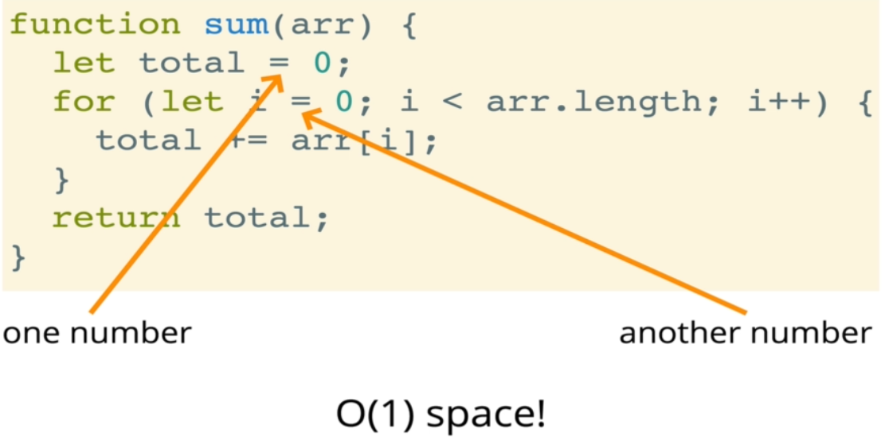
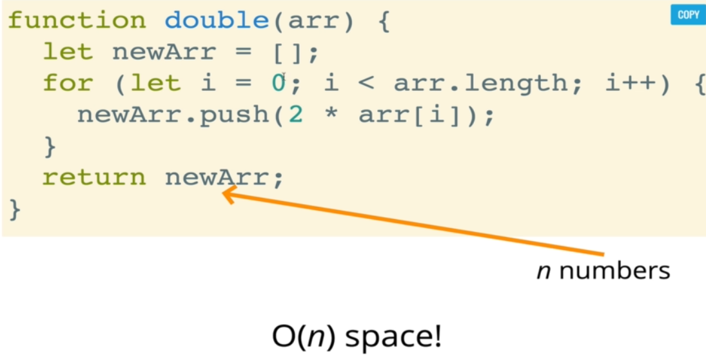
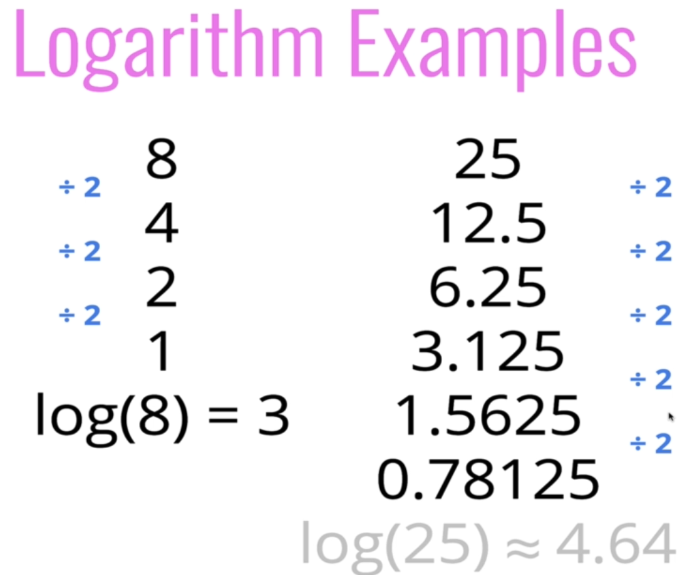

# Big O Notation

# Time Complexity

- We will calculate time complexity mainly on a graph of n(lets say number of operartion) and runtime required for it
- 
- We will have O(1) > O(n) > O(n²)
- 

## O(1)

- To calculate this things we will need to know the number of operation
- More the number of operation more will be time complexity
- 
- for eg refer to image where arithmetic operation will only take 1 operation
- for eg 2+2 will take same time as compare to 100 + 100

## O(n)

- 
- As we can see the no of operation are incresing in image it will take more runtime so here we will have O(n)
- Because as the operation will the runtime will also be increase, shown in below graph
- 
- 
- here we have two O(n) so we will have a O(2n) but still we will count it as a O(n) as we see genral trend no matter cnstants

## O(n²)

- In O(n²) the runtime will increases double in a graph of no of operation
- for eg
- here we have nested loop here we will get a upward curve graph
- 
- 
- 
-

# Space Complexity

- How much additional memory do we need to allocate in order to run the code in our algoritm
- Most primitive(booleans, numbers, undefined, null)are contants
- String require O(n) space (where n is a string length)
- Refrence types are genrally O(n),where n is the length for arrays or the number of keys for object
- O(1) example
- 
- O(n) example
- 

## logarithm examples (log(n))

- 

-
